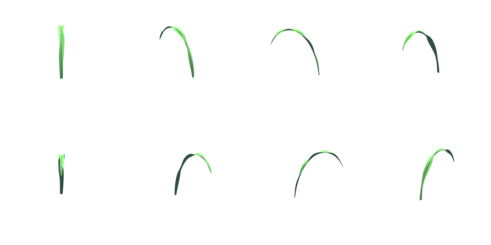

# Parametic Maize Leaf

Implementation of the research paper *Modeling Maize Leaf Geometry and Surface Area by Triangle Mesh*.

## Requirements
- CGAL
- OpenMesh
- Eigen
- GSL
- GLM

## Usage
Please check `main.cpp` for details.

## Example

>Area (cm2): 365.236; \
>M1, M2, MWP: 1.660, 2.763, 0.546; \
>Leaf length, width (cm): 74.9, 5.1; \
>Curve amount: 7; \
>y0-y7 (°): 5.85, -18, 28.35, -24.75, 11.25, -26.1, 7.65; \
>z0-z7 (°): 17.1, -14.4, 9, -21, 6, -12.6, 28.5.

